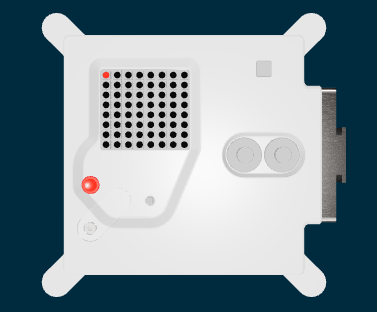

## Create a colour

Create the first colour for your pet picture.

Create a variable called `r` and set its colour to `255, 0, 0`. Then, colour the top-left pixel in that colour.

```python filename="main.py" line_numbers="true" line_number_start="1" line_highlights="7,9"
from sense_hat import SenseHat
from time import sleep

sense = SenseHat()
sense.set_rotation(270, False)

r = (255, 0, 0)

sense.set_pixel(0, 0, r)
```

> [!DEBUG]
>
> Check that you have commas between the numbers in `()`.

## Now run your code

Run your code and check that the top-left LED lights up red.


