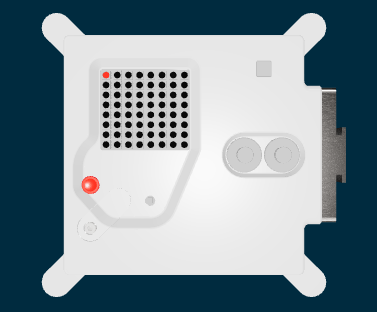

<h2 class="c-project-heading--task">Create a colour</h2>

--- task ---

Create some colours for your pet picture.

--- /task ---

<h2 class="c-project-heading--explainer">Red</h2>

Create a variable called `r` and set its colour to `255, 0, 0`. Then colour the top-left pixel in that colour.

--- code ---
---
language: python
filename: main.py
line_numbers: true
line_number_start: 1
line_highlights: 7, 9
---
from sense_hat import SenseHat
from time import sleep

sense = SenseHat()
sense.set_rotation(270, False)

r = (255, 0, 0)

sense.set_pixel(0, 0, r)
--- /code ---

Run your code.

### Debugging

Check that you have commas between the numbers in `()`.

