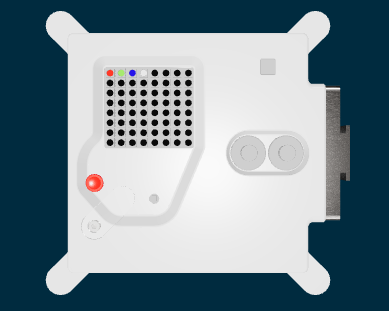

## More colours

Add three more colours to use.

Computers use three numbers to store a colour:
- R: The amount of red from 0 to 255
- G: The amount of green from 0 to 255
- B: The amount of blue from 0 to 255

Add green and blue colours and a new colour of your own to your program.

Use your new colours to colour the pixels on the LED display.

```python filename="main.py" line_numbers="true" line_number_start="7" line_highlights="8-10,13-15"
r = (255, 0, 0)
g = (0, 255, 0)
b = (0, 0, 255)
a = ()

sense.set_pixel(0, 0, r)
sense.set_pixel(1, 0, g)
sense.set_pixel(2, 0, b)
sense.set_pixel(3, 0, a)
```

> [!TIP]
>
> If you want to use black, the numbers are `(0, 0, 0)`.
>
> For white, use `(255, 255, 255)`.
>
> To find more colours to use, you can use a [colour picker](https://share.google/WkKa3VbOYnhYYkC9h){:target="_blank"}.

> [!DEBUG]
>
> Make sure that each of the three colour values is between `0` and `255`.

## Now run your code

Run your code and check that the first four LEDs show red, green, blue, and your own colour.


