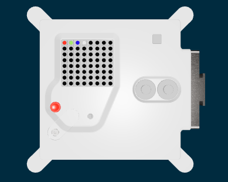

<h2 class="c-project-heading--task">More colours</h2>

--- task ---

Add three more colours to use.

--- /task ---

<h2 class="c-project-heading--explainer">R, G, B</h2>

Computers use three numbers to store a colour.
- R --> The amount of red from 0 to 255
- G --> The amount of green from 0 to 255
- B --> The amount of blue from 0 to 255

--- task ---

Add green and blue colours, and a new colour of your own to your program.

Colour the pixels on the LED display using your new colours.

--- /task ---

--- code ---
---
language: python
filename: main.py
line_numbers: true
line_number_start: 7
line_highlights: 8-10, 13-15
---
r = (255, 0, 0)
g = (0, 255, 0)
b = (0, 0, 255)
a = ()

sense.set_pixel(0, 0, r)
sense.set_pixel(1, 0, g)
sense.set_pixel(2, 0, b)
sense.set_pixel(3, 0, a)
--- /code ---

### Tip

If you want black, then the numbers are `(0, 0, 0)`.

White is `(255, 255, 255)`

You can use a [colour picker](https://share.google/WkKa3VbOYnhYYkC9h){:target="_blank"} to find more colours to use.

### Debugging

Make sure that each of the three colour values is between `0` and `255`.

