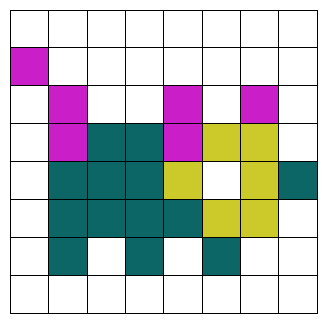
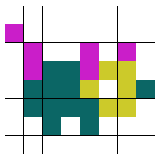

<h2 class="c-project-heading--task">Draw your pixel pet</h2>

Draw the pet you want to show on the LED display on a piece of paper.

<h2 class="c-project-heading--explainer">Draw a picture</h2>

[Here are some examples](https://www.youtube.com/watch?v=PpHFQXoISWc&rel=0){:target="_blank"} to give you an idea.

<h2 class="c-project-heading--explainer">Draw another picture</h2>
You will need another pet picture that is very similar to the first, so you can animate your pet.

The picture below is almost identical to the one above, but the legs are in a different position:

## Now run your code

Check that you have planned two similar 8×8 pet pictures, with a small difference between them for animation.
