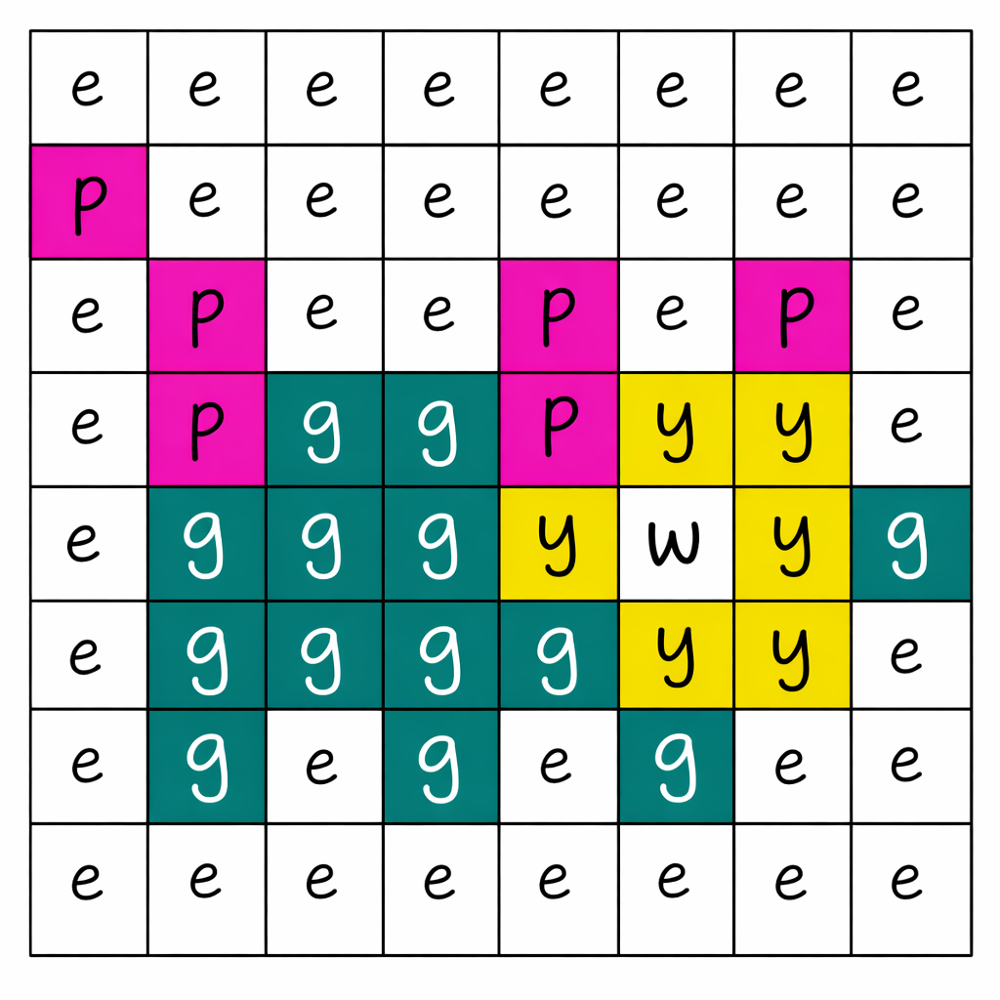
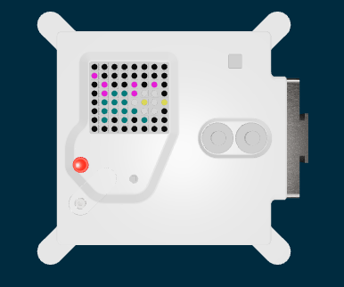

## Draw a picture

Use a list to colour all the pixels.

You could keep setting single pixels to draw a picture using all the LEDs.

But it is easier to write a list, saying what each of the pixels' colours should be.

On your picture, add the letters you need to code each colour. Then, use these letters in your program.



```python filename="main.py" line_numbers="true" line_number_start="7"
p = (204, 0, 204) # Pink
g = (0, 102, 102) # Green
w = (200, 200, 200) # White
y = (204, 204, 0) # Yellow
e = (0, 0, 0) # Empty

pet1 = [
    e, e, e, e, e, e, e, e,
    p, e, e, e, e, e, e, e,
    e, p, e, e, p, e, p, e,
    e, p, g, g, p, w, w, e,
    e, g, g, g, w, y, w, y,
    e, g, g, g, g, w, w, e,
    e, g, e, g, e, g, e, e,
    e, e, e, e, e, e, e, e
    ]

sense.set_pixels(pet1)
```

> [!DEBUG]
>
> This list needs **8** letters in each row and **8** rows in total.
>
> Check that there are commas at the end of each row.

## Now run your code

Run your code and check that your full pet picture appears on the LED display.


