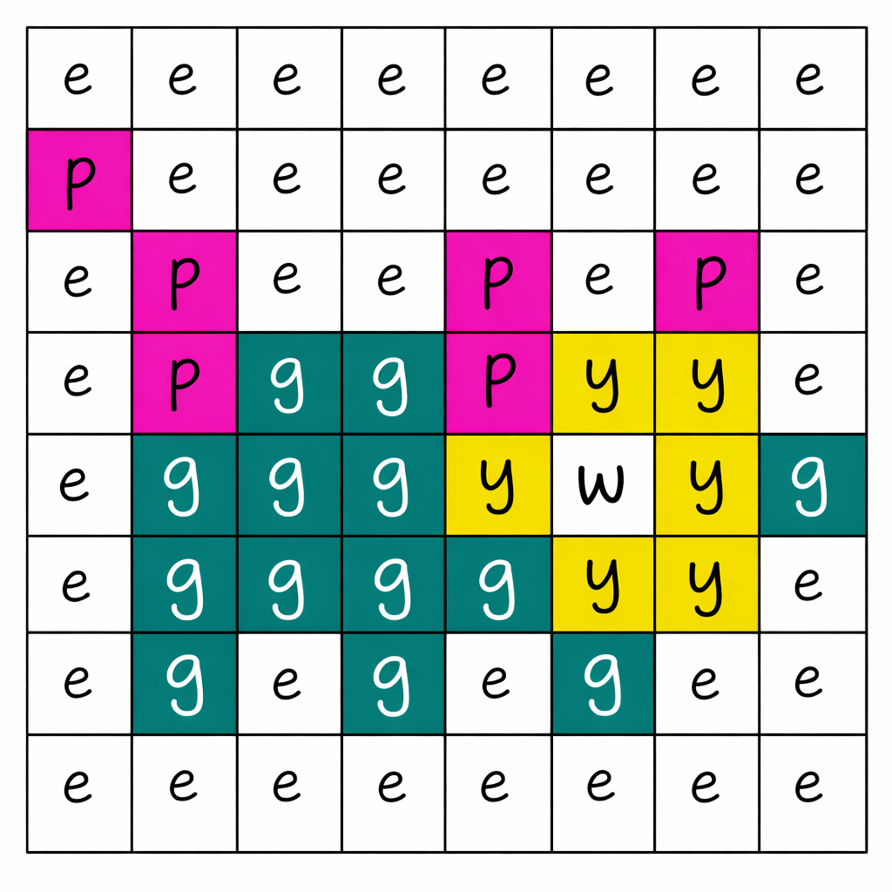
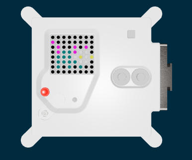

<h2 class="c-project-heading--task">Draw a picture</h2>
--- task ---
Use a list to colour all the pixels.
--- /task ---

<h2 class="c-project-heading--explainer">Pictures with lists</h2>

You could keep setting single pixels to draw a picture using all the LEDs.

It is easier to write a list, saying what each of the pixels' colours should be.

On your picture, add the letters used to code the colour. Then use these letters in your program.

--- code ---
---
language: python
filename: main.py
line_numbers: true
line_number_start: 7
line_highlights: 
---
p = (204, 0, 204) # Pink
g = (0, 102, 102) # Green
w = (200, 200, 200) # White
y = (204, 204, 0) # Yellow
e = (0, 0, 0) # Empty

pet1 = [
    e, e, e, e, e, e, e, e,
    p, e, e, e, e, e, e, e,
    e, p, e, e, p, e, p, e,
    e, p, g, g, p, w, w, e,
    e, g, g, g, w, y, w, y,
    e, g, g, g, g, w, w, e,
    e, g, e, g, e, g, e, e,
    e, e, e, e, e, e, e, e
    ]

sense.set_pixels(pet1)
--- /code ---

### Debugging

This list needs **8** letters on each row and **8** rows in total.

Check that there are commas at the end of each row.

