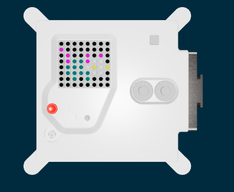

<h2 class="c-project-heading--task">Change the pet</h2>

Create and test the second version of your pet.

<h2 class="c-project-heading--explainer">Write another list</h2>

Create a second list with the changed version of your pet.

To test it, change which version is displayed on the LED display.

--- code ---
---
language: python
filename: main.py
line_numbers: true
line_number_start: 24
line_highlights: 24-33, 36-37
---
pet2 = [
    e, e, e, e, e, e, e, e,
    p, e, e, e, e, e, e, e,
    e, p, e, e, p, e, p, e,
    e, p, g, g, p, w, w, e,
    e, g, g, g, w, y, w, y,
    e, g, g, g, g, w, w, e,
    e, e, g, e, g, e, e, e,
    e, e, e, e, e, e, e, e
    ]

sense.set_pixels(pet1)
sleep(0.5)
sense.set_pixels(pet2)
--- /code ---

## Now run your code

Run your code and check that the second pet picture appears after the first one.
