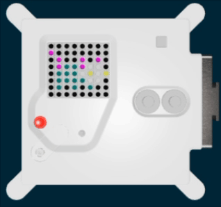

<h2 class="c-project-heading--task">Animate the pet</h2>

You can create an animation by changing the displayed picture.

<h2 class="c-project-heading--explainer">Use a `for` loop</h2>

Create a `for` loop at the end of your program to quickly change between the two versions of the pet.

--- code ---
---
language: python
filename: main.py
line_numbers: true
line_number_start: 35
line_highlights: 
---
for i in range(5):
    sense.set_pixels(pet1)
    sleep(0.5)
    sense.set_pixels(pet2)
    sleep(0.5)
--- /code ---

### Tip

To change the speed of the animation, you can change the `sleep` times.

### Debugging

Check that you have 4 spaces of indentation on the lines beneath your `for` loop.

## Now run your code

Run your code and check that the two pictures play as an animation.
