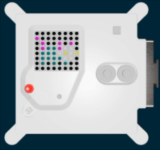

<h2 class="c-project-heading--task">Animate the pet</h2>
--- task ---
You can create an animation, by changing the displayed image.
--- /task ---

<h2 class="c-project-heading--explainer">Use a `for` loop</h2>

Create a `for` loop at the end of your program, to quickly change between the two versions of the pet.

--- code ---
---
language: python
filename: main.py
line_numbers: true
line_number_start: 35
line_highlights: 
---
for i in range(5):
    sense.set_pixels(pet1)
    sleep(0.5)
    sense.set_pixels(pet2)
    sleep(0.5)
--- /code ---

### Tip

You can change the speed of the animation, by changing the `sleep` times.

### Debugging

Check that you have four spaces of indentation on the lines beneath your `for` loop.

