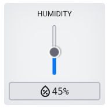

<h2 class="c-project-heading--task">Trigger the animation</h2>

You can make the animation run when the environment changes.

<h2 class="c-project-heading--explainer">Call your own function</h2>

The `for` loop can sit inside a function. This can be **called** whenever the humidity changes.

--- code ---
---
language: python
filename: main.py
line_numbers: true
line_number_start: 35
line_highlights: 
---
def walking():
    for i in range(5):
        sense.set_pixels(pet1)
        sleep(0.5)
        sense.set_pixels(pet2)
        sleep(0.5)

while True:
    hum = sense.get_humidity()
    if hum > 50:
        walking()
--- /code ---

### Tip

Change the humidity using the slider.

## Now run your code

Run your code, raise the humidity above 50 with the slider, and check that your pet starts walking.
